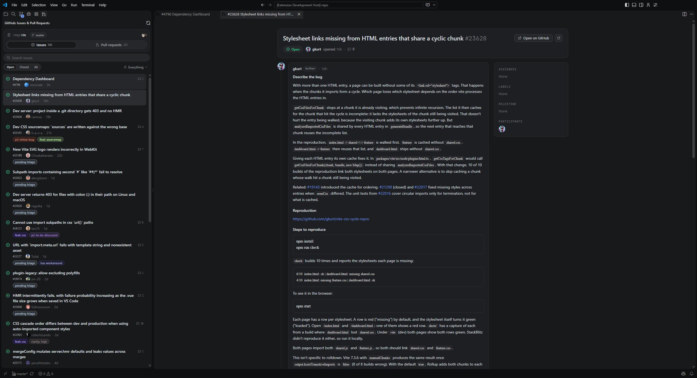

# Islet

GitHub issues and pull requests for the repository you're working in, without leaving VS Code.

Islet adds a GitHub panel to the activity bar. It follows the repository selected in Source Control
and shows its issues and pull requests in a calm, Islands-style UI: soft rounded panels, label pills
and a quiet colour palette that only uses colour where it means something.



## Features

- **Follows your repository.** Uses the repository selected in Source Control (or the one your
  active file belongs to) and its GitHub remote. Switch repositories and the list follows.
- **Issues and pull requests list** with counts, search, Open / Closed / All, and filters for
  *Created by me*, *Assigned to me* and *Review requested*. Rows show state, labels, comment count,
  check status, review decision and branches.
- **Detail view in an editor tab.** Description, comments with reactions, reviews and events in one
  timeline, plus assignees, labels, milestone, reviewers, checks and participants.
- **Pull requests:** *Files changed* with per-file stats (click a file to open a side-by-side diff),
  *Checks* with status per run, and **Checkout** to switch to the pull request's branch locally.
- **Comment** on issues and pull requests from the detail view (Ctrl+Enter to send).
- Uses VS Code's built-in GitHub sign-in. Islet never stores a token itself.

### Gradle test results

Islet also brings a JetBrains-style test window to Gradle projects (Kotlin and Java, JUnit 5).

- **Every test run shows up in the Testing panel**: `./gradlew test` in any terminal, the Gradle
  extension's Tasks view, or Islet's own Run buttons. Islet reads the JUnit XML files Gradle writes
  to `build/test-results/`, so it does not matter how Gradle was started.
- **Test Results opens when a run starts**, with pass / fail / skipped and timings per test.
- **Live progress like JetBrains:** a spinner on each running test and a counter that moves as each
  test finishes. Islet passes a small Gradle init script to its own runs for this. To get live
  progress for runs started from the terminal or the Gradle Tasks view too, turn on
  `islet.gradleTests.trackAllRuns`: it installs the same script in `~/.gradle/init.d` (and removes
  it when turned off). The script only writes to each project's `build/islet/` folder, never fails a
  build, and stays inactive in builds that use the configuration cache. Without it, those runs show
  their results as soon as Gradle finishes.
- **Tree by module, class, nested class, test and parameterized invocation.** Works with
  multi-module builds and with several Gradle builds in one workspace.
- **Gradle Tests console**, like JetBrains' Run window: an editor tab (or panel terminal, see
  `islet.gradleTests.console`) that streams the run as it happens: Gradle's own output for runs
  started from Islet, everything the tests and your application print, each failure in red with
  its stack trace (file locations are clickable), and a summary such as
  `Tests: 1258 passed, 2 failed, 1 skipped · 2m 14s`. Closed it? **Islet: Show Gradle Tests Console**
  (or the console button in the Testing panel toolbar) reopens it with the whole run. Islet runs Gradle with `--continue`, so every
  module's tests run even when one fails, and runs a whole build in a single Gradle call.
- **Full test output, live:** everything your tests and application print (for example a Quarkus
  backend's startup and request logs) streams into Test Results while the tests run, stderr in red.
  Each line is attached to the test that printed it; output from class-level setup goes to the
  class. Select a test to see only its output, or use **Test: Show Output** for the whole run. Runs
  without the live reporter show the output Gradle stored in its report after the run.
- **Failures** show the message and stack trace, jump to the failing line, and offer an
  expected / actual diff for `assertEquals` failures. Red and green marks appear next to tests in the
  editor.
- **Run buttons** in the panel and next to every test, class and module. They run
  `gradlew :module:test --rerun --tests …` for just that selection.
- Tests are found in `src/*test*/{kotlin,java}` from their `@Test`, `@ParameterizedTest`,
  `@RepeatedTest`, `@TestFactory` and `@TestTemplate` annotations, so run buttons appear before the
  first run.

Settings: `islet.gradleTests.enabled` (default on), `islet.gradleTests.revealOnRun` (open Test
Results when a run starts, default on), `islet.gradleTests.console` (`editor`, `panel` or `off`, default `editor`) and `islet.gradleTests.trackAllRuns` (live progress for runs
started outside Islet, default off).

## Install

Islet isn't on the Marketplace yet. Build the package and install it:

```bash
git clone https://github.com/ReaperMaga/islet.git
cd islet
npm install
npm run package
code --install-extension islet-0.6.0.vsix
```

Then reload VS Code, click the GitHub icon in the activity bar and sign in when asked.

Requirements: VS Code 1.95 or newer, a repository with a GitHub remote, and Git.

## Commands

| Command | What it does |
| --- | --- |
| `Islet: Refresh` | Reloads the list and any open detail tabs. |
| `Islet: Sign in to GitHub` | Signs in with VS Code's GitHub account. |
| `Islet: Open Issue or Pull Request…` | Opens an item by number. |
| `Islet: Show Gradle Tests Console` | Shows the test console, reopening it with the current or last run. |
| `Islet: Stop All Gradle Processes` | Stops every Gradle build, test JVM and daemon on this computer, after asking. Also a stop button in the Testing panel toolbar. |

## Development

```bash
npm install
npm run build       # bundle extension + webviews into dist/
npm run watch       # rebuild on change
npm run typecheck
```

Press F5 in VS Code with this folder open to start an Extension Development Host.

**Previewing the UI in a browser.** `dev/sidebar.html` and `dev/detail.html` run the webviews
with a fake host and recorded data from `src/webview/mock/fixtures.json`, so the design can be
worked on without VS Code. Open them after `npm run build`; the detail page takes
`?kind=issue|pull&number=N`.

**Recording fresh preview data.** `scripts/dump-fixtures.ts` reads from GitHub with the token of the
GitHub CLI (`gh auth token`). It only reads.

**Testing without signing in.** In an Extension Development Host only, Islet uses the token in
the `ISLET_DEV_TOKEN` environment variable if it is set. Installed builds ignore it.

### Project layout

```
src/extension/   extension host: views, panels, auth, repository detection, checkout, diffs
src/extension/tests/  Gradle test results: JUnit XML parser, test discovery, Testing panel
src/api/         GitHub GraphQL client
src/shared/      types and message protocol shared by every part
src/webview/     sidebar and detail webviews, shared theme and helpers, browser mock host
dev/             browser preview pages
```

See [DESIGN.md](DESIGN.md) for the design rules and architecture notes.

## Known limitations

- Review requests to teams are not shown, only to people.
- Pull requests from forks show the branch without the fork owner.
- Commenting is supported; approving, requesting changes and merging are not yet.
- Gradle tests: running from the panel needs Gradle 7.6 or newer (for `--rerun`); debugging tests
  from the panel is not supported yet; Kotest and other non-JUnit styles are only shown after they
  have run.

## Credits

The look is inspired by JetBrains' Air and Islands interfaces. Islet is an independent project and
is not affiliated with or endorsed by JetBrains.

## License

[MIT](LICENSE)
